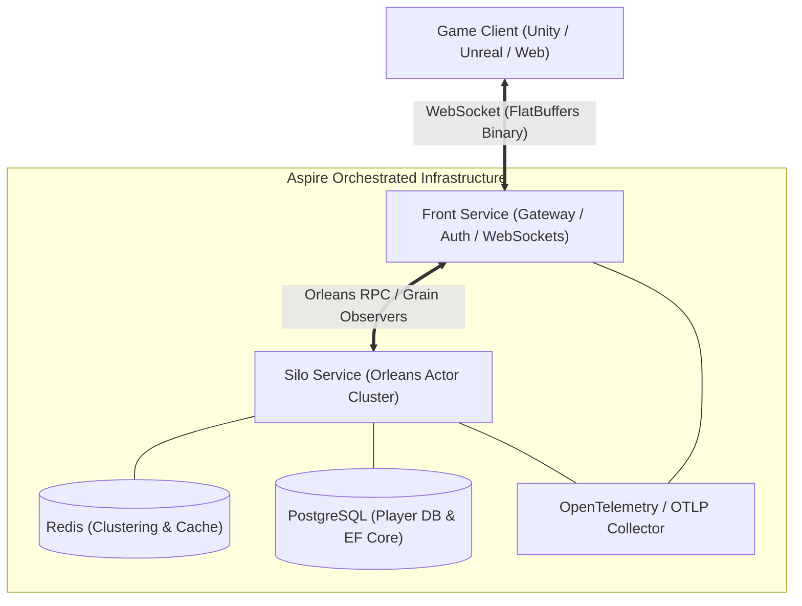

# ABMGS (Actor-Based Multiplayer Game Server)
> Also known as **SyncnetPlatform** — A high-performance, cloud-native multiplayer game server framework built on **.NET 10**, **Microsoft Orleans**, and **.NET Aspire**.

---

## 1. Overview

**ABMGS** is a modern, distributed backend framework tailored for real-time multiplayer games and online services. By combining the **Virtual Actor model (Microsoft Orleans)** with **Google FlatBuffers** and **WebSockets**, it provides an elastic, fault-tolerant, and low-latency foundation for game developers. The entire multi-service lifecycle is seamlessly managed and orchestrated using **.NET Aspire**.

---

## 2. Key Architecture & Design



### Core Architecture Pillars

1. **Virtual Actor Model (Microsoft Orleans)**:
   - **`PlayerActor`**: Manages dedicated player state, lifecycle (connect/disconnect/reconnect), packet queuing via `System.Threading.Channels`, and decoupled packet routing.
   - **`PlayRoomActor`**: Handles room lifecycles, matchmaking/room joins, player synchronization, and periodic server ticks via Orleans timers.
   - **`PlayerInventoryActor`**: Manages dedicated persistence and transactional player inventory data.

2. **High-Performance Binary Serialization (Google FlatBuffers)**:
   - Zero-copy deserialization using FlatBuffers schema compiler (`flatc`).
   - Packets defined in `.fbs` schemas (`System.fbs`, `Player.fbs`, `Playroom.fbs`) automatically routed via attribute-based dispatchers (`[PacketHandler]`).

3. **Bidirectional Real-Time Communication**:
   - ASP.NET Core WebSockets termination at the `Front` gateway.
   - Backpressure-protected asynchronous send/receive loops backed by bounded channels.
   - Grain observers (`ISendDataGrain` / `ISendDataObserver`) pushing real-time actor events down to client sockets.

4. **Authentication & Identity**:
   - Modular authentication supporting **Google Play Games Services**, **Guest Accounts**, with extensibility for **Apple** and **Steam**.
   - Stateless JWT token issuance and policy-based WebSocket authentication (`GameSocketPolicy`).

5. **Extensible Persistence & Dynamic Relational Schemas**:
   - PostgreSQL backed by Entity Framework Core (`SyncnetDbContext`).
   - Dynamic schema extension using EF Core **Indexer Properties**, allowing developers to declare custom database columns on the fly without modifying framework models.
   - Automated schema migrations on Silo startup (`AutoMigrateDatabase = true`).

6. **Cloud-Native & Distributed by Design**:
   - **.NET Aspire AppHost** configures and launches Postgres, Redis, Silo, and Front in a unified local or cloud topology.
   - Distributed tracing and metrics via **OpenTelemetry** with end-to-end trace propagation across WebSockets and grain calls (`traceparent`).

---

## 3. Repository Structure

```text
ABMGS/
├── Source/
│   ├── AppHost/           # .NET Aspire orchestration & dependency wiring
│   ├── Front/             # API gateway, auth endpoints, and WebSocket session manager
│   ├── Silo/              # Orleans Silo hosting actor grains & sample game logic (Tic-Tac-Toe)
│   ├── Package/           # Core framework ("SyncnetPlatform")
│   │   ├── Actors/        # Base PlayerActor, PlayRoomActor, and state definitions
│   │   ├── ApplicationBuilder/ # Fluent builder APIs for Front and Silo applications
│   │   ├── Authentication/ # Google Play and Guest authentication providers
│   │   ├── Controllers/   # HTTP and WebSocket endpoints
│   │   ├── Databases/     # EF Core DbContext & dynamic schema extension hooks
│   │   ├── fbs/           # FlatBuffers protocol definitions & flatc build targets
│   │   ├── Network/       # Packet routers, session handlers, and send buffers
│   │   └── Repositories/  # Data access abstractions & implementations
│   ├── Migrations/        # PostgreSQL schema migrations
│   └── Tests/             # Aspire-driven end-to-end and integration test suite
```

---

## 4. Extensibility: Custom Game Logic & Database Schema

Developers can extend gameplay rules and persist game-specific data directly without modifying the core framework plumbing:

### A. User-Defined Database Schemas (`IPlayerDataExtendCreater`)
Developers can define and add custom columns to the `player_data` PostgreSQL table without editing framework entity models:
- Implement `IPlayerDataExtendCreater` to register custom column definitions (type, name, default value).
- Register via `option.UsePlayerDataExtendCreator<T>()` in the Silo startup builder.
- Fields are mapped at runtime using EF Core **Indexer Properties** (`playerData[key]`).
- Enable `option.AutoMigrateDatabase = true` to automatically apply migrations on startup.

```csharp
// Example: Silo/Models/TttGamePlayerModelExtend.cs
public class TttGamePlayerModelExtend : IPlayerDataExtendCreater
{
    public IReadOnlyList<(Type, string, object)> RegisterPlayerCustomData() =>
    [
        (typeof(int), "WinCount", 0),
        (typeof(int), "LoseCount", 0),
        (typeof(int), "PlayCount", 0)
    ];
}

// In Silo Program.cs:
builder.ConfigureActor(option =>
{
    option.UsePlayerDataExtendCreator<TttGamePlayerModelExtend>();
    option.AutoMigrateDatabase = true;
});
```

### B. Custom Player & Room Behaviors
- **Player Behavior**: Implement `IPlayerCustomBehavior` to define game-specific player actions, stats delegation, and custom packet handlers.
- **Room Lifecycle & Rules**: Implement `IPlayRoomCustomEventHandler` and `IPlayRoomCustomState` to manage custom room state, turn progression, and room timer ticks.
- *Reference Implementation*: See `Source/Silo/Player/` for a complete **Tic-Tac-Toe** (`TttGame*`) implementation showcasing room creation, moves, and win-condition checks.

---

## 5. Technology Stack

| Domain | Technologies |
|---|---|
| **Runtime & Language** | .NET 10 / C# 13 |
| **Actor Framework** | Microsoft Orleans 10.x |
| **Orchestration** | .NET Aspire |
| **Protocol / Serialization**| Google FlatBuffers (`flatc`) |
| **Transport** | WebSockets (Binary) |
| **Databases & Cache** | PostgreSQL (EF Core, Npgsql), Redis (Clustering & Cache) |
| **Observability** | OpenTelemetry, Serilog |
| **Testing** | xUnit, Aspire AppHost Fixtures |

---

## 6. Quickstart

### Prerequisites
- [.NET 10 SDK](https://dotnet.microsoft.com/download)
- Docker Desktop or Podman (for Aspire container resources: Postgres, Redis)

### Running the System
```bash
# 1. Clone the repository
git clone https://github.com/jun92/ABMGS.git
cd ABMGS/Source

# 2. Launch using .NET Aspire AppHost (starts Redis, Postgres, Silo, and Front)
dotnet run --project AppHost/AppHost.csproj
```

### Running Tests
```bash
dotnet test Tests/Tests.csproj
```
